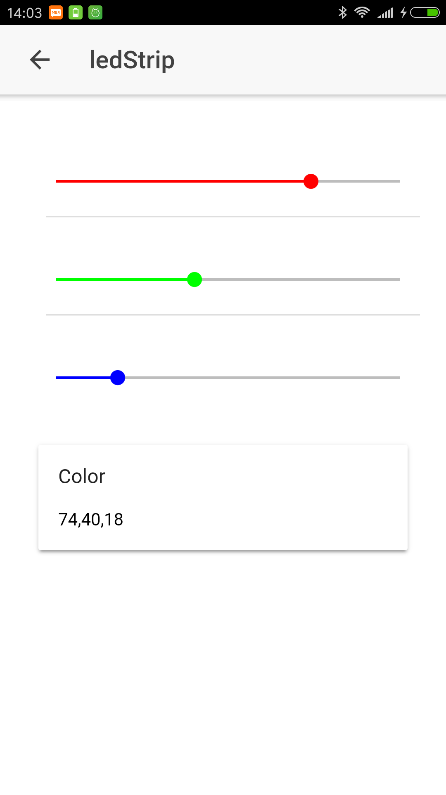
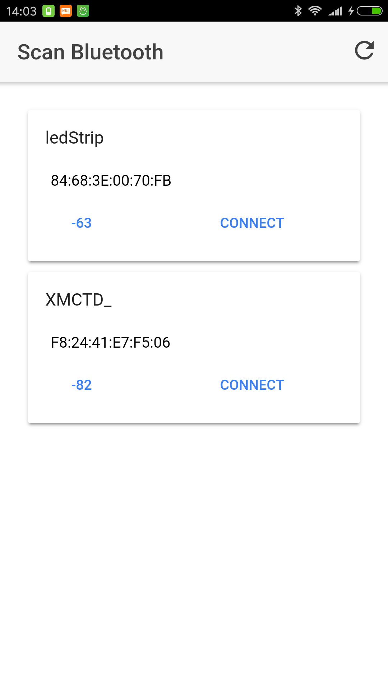

# Skeleton of a simple Ionic2 app that scans fro BLE devices, connects to one of them and sends out data.

I't was not easy to go through the Ionic 2 BLE api, so I put together some code that could be use as reference for future BLE projects.

The web apps, features to pages:
_ The firstone serves for scanning the list of devices and visualize them on a grid.
_ The second one features an interface with 3 range sliders; By moving the sliders, you send out 3byte of data with color information

Attached you can also find an Arduino sketch for an Arduino101 acting as a BLE slave, it reads the data and change the color of a LED strip.

